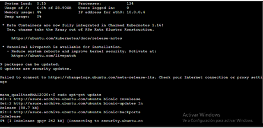

# Practica_01

## Creacion de de una API por medio de un administrador de Base de datos
### Creación de una maquina virtual por en Microsoft Azure

Para crear una máquina virtual es necesario tener una cuenta de Microsoft Azure en la que se registrará. 
Siguiendo la siguiente liga propuesta y hecha por el profesor Jacobo nuestra máquina virtual debe tener algunas características:

   * Public IP address: enable
   * Operating system: Linux (ubuntu 18.04)
   * Size: Standard D2s v3 (2 vcpus, 8 GiB memory)
   
   
   

[Ecosistema de un Administrador de Bases de datos y creación de una API](https://nbviewer.jupyter.org/github/JacoboGGLeon/abd_2020_1/blob/master/practica_01.ipynb#En-la-ra%C3%ADz-del-proyecto-crear-un-archivo-llamado-puppies.sql)


## Actualización e instalación de paquetes: Serial console
Consecuentemente se debe instalar y actualizar el índice de paquetes, **NodoJS**, **NPM de NodeJS**, **el generador de aplicaciones Express** y **PostgreSQL**, se mantiene algunas configuraciones y comandos de inicializar el proyecto
 


## Creacion de nueva carpeta

Se hace la creación de dos carpetas una como **proyecto** y la otra con el nombre de **practica_01**, en ellas se crea un nuevo proyectos **_Express y sus dependencias_** 
 


## Creación de Base de Datos 
##
Se necesita crear la raíz del proyecto con el nombre de **_queries.js_**
 


**_Nota: Los siguientes archivos se deben instalar en postgres, es frecuente que se comata el error de querer instlarlos en el usuario de lo contrario si estas en el super usuario solo con el comando **_\q_**, y para entrar a Postgres con el comando **_$psql_** _**


Utilizando la raíz del proyecto se hace la creación de un archivo que le damos el nombre de puppies.sql, se hacen algunas configuraciones, haciendo la creación de la base de datos **_puppies_** , así como también la creación de una tabla con los atributos  **_  ID, name, breed, age, sex _** y se hace la inserción de la una fila.

 


## Configuramos las ruras 
Las configuraciones de rutas, se llaman desde postgres con la el comando **_ cd routes/ _** editando el archivo/routes/indes.js con el comando de superusuario **_  sudo nano index.js _**


## Utilizando el método GET
Con el comando **_ http://23.100.21.187:3000/api/puppies_** para el método GET y el comando **_http://localhost:3000/api/puppies/1_** para el método GetSINGLE
 

                   ```
                  http://23.100.21.187:3000/api/puppies

                  {
                      "name": "Laily",
                      "breed": "blabla",
                      "age": 9,
                      "sex": "f"
                  }
                  ```
## Método PUT
Con la utilización del **_ método PUT_** este nos ayuda a reemplazar y actualizar los recursos solicitados con la carga de entrada y salida constante ( lo que sube el archivo con atributos actualizados)


                    ```
                  http://23.100.21.187:3000/api/puppies/1

                        {
                        "name": "Hunter",
                        "breed": "annoying",
                        "age": 33,
                        "sex": "m"
                        }
                    ```
